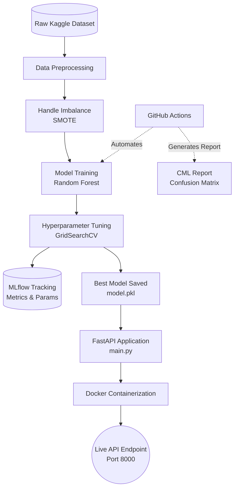

# Student Academic Risk Prediction - End-to-End MLOps Pipeline

## 📌 Project Overview
This project is an end-to-end Machine Learning Operations (MLOps) pipeline designed to predict student academic risk (Dropout, Enrolled, or Graduate) in higher education. The goal is to identify at-risk students early using machine learning, fully automated from data preprocessing to production deployment.

## 🏗️ System Architecture



*(Note: GitHub will automatically render this code block into a visual architecture diagram).*

## 🚀 Key Features & Workflow (What We Did)

1. **Data Preprocessing & Balancing:**
* Cleaned the dataset and dropped irrelevant features.
* Encoded categorical variables using `LabelEncoder` and `One-Hot Encoding`.
* Scaled numerical features using `StandardScaler`.
* Handled severe class imbalance using **SMOTE** (Synthetic Minority Over-sampling Technique).


2. **Model Training & Hyperparameter Tuning:**
* Trained a `RandomForestClassifier`.
* Utilized `GridSearchCV` (with parallel processing `n_jobs=-1`) to find the most optimal hyperparameters (`n_estimators`, `max_depth`, `min_samples_split`).


3. **Experiment Tracking (MLflow):**
* Integrated **MLflow** to automatically log model parameters, metrics (accuracy, F1-score), and the serialized model.
* Handled `skops_trusted_types` to securely log Scikit-Learn tree-based models.


4. **Continuous Integration / Continuous Machine Learning (CI/CD):**
* Configured **GitHub Actions** to automatically trigger the pipeline on every push to the `main` branch.
* Integrated **CML** to automatically generate model performance reports (Accuracy & Confusion Matrix plots) and post them directly as comments on GitHub commits/PRs.


5. **API Development:**
* Developed a high-performance REST API using **FastAPI** to serve the trained model for real-time inference.


6. **Containerization:**
* Packaged the entire application, dependencies, and model into a **Docker** image using a `python:3.12-slim` base image for lightweight and reliable deployment.


## 📁 Project Structure

```text
MLproject/
├── .github/workflows/
│   └── cml.yml               # CI/CD Pipeline Configuration
├── data/
│   └── data.csv              # Raw Dataset (Not tracked in Git)
├── src/
│   └── process.py            # Data preprocessing, training, & MLflow tracking script
├── mlruns/                   # MLflow local experiment logs
├── main.py                   # FastAPI application
├── Dockerfile                # Docker image configuration
├── requirements.txt          # Python dependencies
├── model.pkl                 # Serialized best model
└── .gitignore                # Ignored files configuration

```

## 🛠️ How to Run Locally

### 1. Setup Environment

Ensure you have Python 3.12 installed. Install the required dependencies:

```bash
pip install -r requirements.txt

```

### 2. Train the Model & View MLflow Logs

Run the training script to preprocess data, train the model, and save the best parameters:

```bash
python src/process.py

```

To view the MLflow UI:

```bash
mlflow ui

```

### 3. Run the API (Without Docker)

Start the FastAPI server using Uvicorn:

```bash
uvicorn main:app --host 0.0.0.0 --port 8000 --reload

```

Visit `http://localhost:8000/docs` to test the API via Swagger UI.

## 🐳 How to Run with Docker

Build the Docker image:

```bash
docker build -t student-risk-api .

```

Run the container:

```bash
docker run -p 8000:8000 student-risk-api

```

The API will be accessible at `http://localhost:8000/docs`.

## 📡 API Usage

**Endpoint:** `POST /predict`

**Sample Input (JSON):**

```json
{
  "Feature1": 1.5,
  "Feature2": 0,
  "Course_Nursing": 1
}

```

**Sample Output (JSON):**

```json
{
  "prediction": "Graduate"
}

```